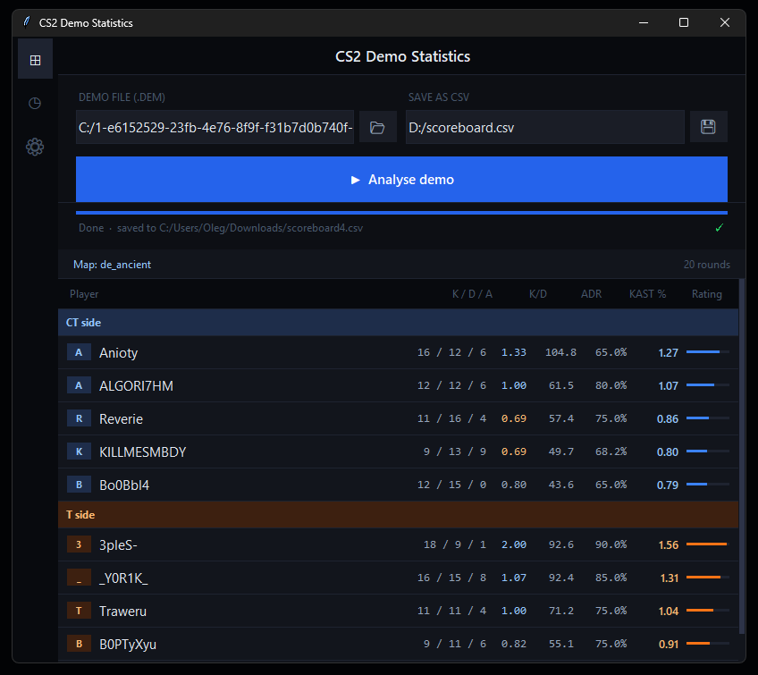

# CS2 Demo Statistics

Десктопное приложение для анализа демок CS2 (.dem). Парсит демку и показывает скорборд с детальной статистикой по каждому игроку: K/D/A, ADR, KAST%, Rating. Результат можно сохранить в CSV.



## 📥 Скачать

Готовая версия для Windows — без установки Python, просто скачать и запустить:

**[⬇ Скачать последнюю версию (.exe)](https://github.com/Pryzrock/CS2-Demo-Stats/releases/latest/download/CS2.Demo.Stats.by.PryZ.v.0.2.3.exe)**

Все версии и история изменений — на странице [Releases](https://github.com/Pryzrock/CS2-Demo-Stats/releases).

> Если демка в формате `.dem.zst`, сначала распакуй её:
> ```
> zstd -d match.dem.zst -o match.dem
> ```

## Возможности

- Парсинг демок CS2 (формат `.dem`)
- Подробная статистика по каждому игроку: Kills/Deaths/Assists, K/D, ADR, KAST%, Rating
- Разделение по командам (CT / T)
- Экспорт результатов в CSV
- Информация о карте и количестве раундов

## Запуск из исходников

Если хочешь запустить из кода, а не через готовый .exe:

```bash
git clone https://github.com/Pryzrock/CS2-Demo-Stats.git
cd CS2-Demo-Stats
pip install -r requirements.txt
python main.py
```

### Зависимости

- Python 3.12-
- [awpy](https://github.com/pnxenopoulos/awpy) — парсинг демок CS2
- [polars](https://pola.rs/) — обработка данных


## Как использовать

1. Запусти `CS2DemoStats.exe`
2. Выбери файл демки (.dem) в поле **Demo file**
3. Укажи, куда сохранить результат, в поле **Save as CSV**
4. Нажми **▶ Analyse demo**
5. После завершения парсинга появится таблица со статистикой, а CSV сохранится по указанному пути
